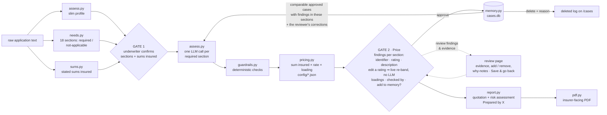
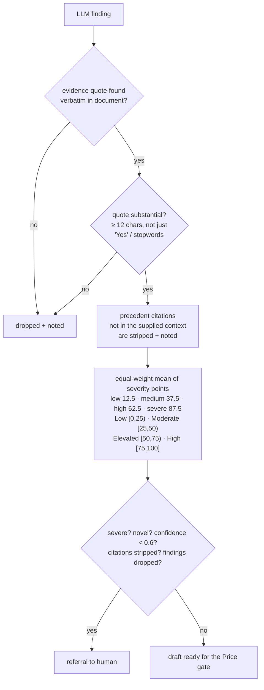

# How It All Links Together

One page. The design rationale lives in [SOLUTION_DESIGN.md](SOLUTION_DESIGN.md), and
the run / configure / test instructions in the [README](../README.md); this is the map
you need to change things.

## The flow of one assessment

Read it as: **the LLM proposes, guardrails verify, a human decides, memory remembers —
and the pricing engine calculates, with no LLM in it.** The arrow from the Price gate
back into memory is the whole "self-learning" trick — the next assessment retrieves what
this underwriter just approved, corrections included.

Two human gates, in order: the needs table with a sum insured per required section
(what gets assessed and priced), and the Price gate (what gets rated, quoted and
remembered, under a named "checked by"). The review page is a drill-down from the
Price gate for evidence and add/remove; it stores nothing. Nothing crosses a gate
without a person clicking.

The section calls in the middle run concurrently and are independent of each other:
each one sees only its section's scope and the precedent findings under that section,
each precedent followed by the reviewer's changes in that section. Drafts waiting at a
gate live in process memory (`PENDING_NEEDS`, `DRAFTS` in `main.py`) — a restart loses
them, which is fine for a single-process POC.

## What guards what

Everything in this diagram is plain Python in `guardrails.py` — no LLM. The LLM
emits severity only (low / medium / high / severe). Guardrails map severity to
points, average them with equal weights, and look up the band — arithmetic an
underwriter can reproduce by hand. The Price page's script is handed the same
points and thresholds so a rating change re-bands live to the verdict the server
will store. The same evidence check applies to findings a reviewer adds on the
review page.

`score_section()` applies the same mean rule to one section's findings and
returns the whole breakdown — deliberately the **single seam** for section
rating. The pricing engine reads the band and score from it and picks the
loading from `config/loadings.json`; change how sections are scored by changing
that one path (and `config/severity_points.json`).

## Which file does what

| File | Job | Change it when… |
|---|---|---|
| `app/llm.py` | The **only** file that talks to an AI vendor (Gemini, Anthropic, or the keyless `claude` CLI). No provider → the app refuses to start. Records token usage per call. | you switch provider or model names |
| `app/sections.py` | The 18 cover sections and Motor sub-types, transcribed from `Needs Analysis.pdf` | the needs analysis document changes (and only then) |
| `app/models.py` | The data shapes (`SectionNeed`, `RiskFinding`, `CaseRecord`, …) | you want findings or cases to carry a new field |
| `app/needs.py` | Classifies every section required / not-applicable; repairs missing rows | you want to tune what "needs" means |
| `app/sums.py` | Transcribes the sums insured the submission states, for the broker to confirm at gate 1 | you want to change what counts as a stated figure |
| `app/assess.py` | Profile extraction, then one prompt per required section (scope + section precedents with the reviewer's corrections + document) | you want to tune the assessment prompt, or how a precedent is rendered |
| `app/guardrails.py` | Evidence check, citation allow-list, band rule, referral triggers | you want different thresholds or band boundaries |
| `app/pricing.py` | Deterministic premium calculation + the `config/*.json` rate/loading tables | rates change shape, or pricing grows a new input |
| `app/memory.py` | SQLite case store, LLM-as-picker retrieval scoped to the sections being assessed, soft delete | you want smarter retrieval (e.g. embeddings) — swap `retrieve()` only |
| `app/main.py` | FastAPI routes (thin plumbing) | you add a page or endpoint |
| `app/report.py` + `templates/` | HTML rendering only | you change how pages look |
| `app/pdf.py` + `templates/case_pdf.html` | Insurer-facing PDF of an approved case (mirrors `report.html`), via xhtml2pdf | you change what the insurer sees |
| `app/ingest_chats.py` | One-off: seed memory (provisional) from historical chat transcripts | you get real client chat exports |
| `app/evaluate.py` | Proves learning: memory-on vs memory-off, leave-one-out | before a pitch |

## Where the learning lives (one inspectable file)

- `data/cases.db` — one row per case (SQLite JSON). Cases approved at the Price gate
  with "add to case memory" ticked are precedents immediately; chat-ingested cases,
  and cases approved with it unticked, are stored `provisional` and stay invisible to
  retrieval until confirmed on `/cases`. Unreviewed drafts never enter. Deleted cases
  keep their row (who, when, why) but leave retrieval and the listing; IDs never reuse.
- The lesson is inside the case: `corrections` (removed / added / severity_changed,
  each with the reviewer's why-note) are rendered into the precedent text for the
  section they belong to (`assess.py::_render_precedent`).

Delete the `data/` folder to factory-reset; `python -m app.ingest_chats` re-seeds it.

Pricing and scoring configuration is *not* in `data/`: `config/rates.json`,
`config/loadings.json`, and `config/severity_points.json` are git-tracked.
Rates and loadings are editable on `/rates`; severity points and band thresholds
are hand-edited and validated when loaded (a bad edit fails loudly rather than
mis-banding). Stored cases keep the pricing they were approved with; a config
change only affects what is scored and priced next.
