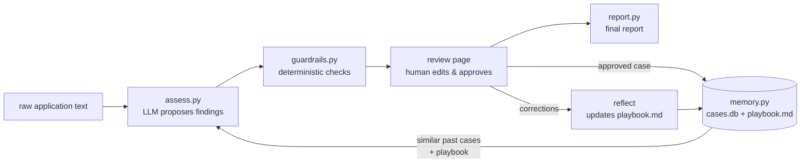
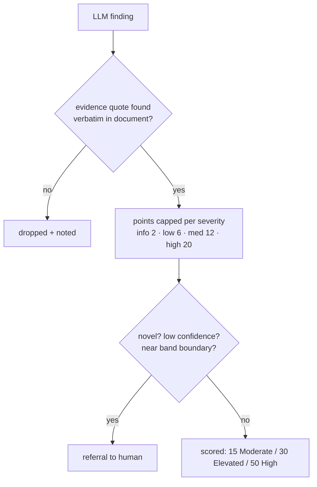

# How It All Links Together

One page. The full design rationale lives in [SOLUTION_DESIGN.md](SOLUTION_DESIGN.md);
this is the map you need to change things.

## The flow of one assessment



Read it as: **the LLM proposes, guardrails verify, a human decides, memory remembers.**
The arrow from the review page back into memory is the whole "self-learning" trick —
the next assessment retrieves what this reviewer just approved.

## What guards what



Everything in this diagram is plain Python in `guardrails.py` — no LLM. An underwriter
can reproduce any score by hand.

## Which file does what

| File | Job | Change it when… |
|---|---|---|
| `app/llm.py` | The **only** file that talks to an AI vendor (Gemini default, or Anthropic). No key → the app refuses to start. | you switch provider or model names |
| `app/models.py` | The data shapes (`RiskFinding`, `CaseRecord`, …) | you want findings to carry a new field |
| `app/assess.py` | Builds the prompt (playbook + precedents + document) and calls the LLM | you want to tune the assessment prompt |
| `app/guardrails.py` | Evidence check, point caps, bands, referrals | you want different caps/thresholds |
| `app/memory.py` | SQLite case store, retrieval, playbook + reflection | you want smarter retrieval (e.g. embeddings) — swap `retrieve()` only |
| `app/main.py` | FastAPI routes (thin plumbing) | you add a page or endpoint |
| `app/report.py` + `templates/` | HTML rendering only | you change how pages look |
| `app/ingest_chats.py` | One-off: seed memory from historical chat transcripts | you get real client chat exports |
| `app/evaluate.py` | Proves learning: memory-on vs memory-off comparison | before a pitch |

Tests fake the LLM (`tests/conftest.py` swaps `llm.generate` for canned responses),
so `pytest` runs offline and deterministic.

## Where the learning lives (all inspectable files)

- `data/cases.db` — one row per **human-approved** case (SQLite). Unreviewed drafts never enter.
- `data/playbook.md` — plain markdown lessons; open it, edit it, audit it.
- `data/playbook_history/` — a copy of every previous playbook version.

Delete the `data/` folder to factory-reset; `python -m app.ingest_chats` re-seeds it.

## Swapping the AI

Set one environment variable — nothing else changes:

```bash
export GEMINI_API_KEY=...      # → Gemini (gemini-2.5-pro / -flash)
export ANTHROPIC_API_KEY=...   # → Claude (claude-opus-4-8 / haiku)
export LLM_MODEL_MAIN=...      # optional per-tier model override
```

With neither set, the app raises a clear error **at startup** — there is no
fallback logic to maintain. Adding a new provider = one `_<name>_generate()`
function in `llm.py`.
