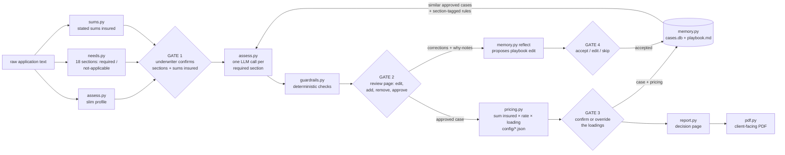
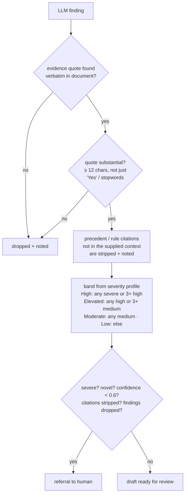

# How It All Links Together

One page. The design rationale lives in [SOLUTION_DESIGN.md](SOLUTION_DESIGN.md), and
the run / configure / test instructions in the [README](../README.md); this is the map
you need to change things.

## The flow of one assessment

Read it as: **the LLM proposes, guardrails verify, a human decides, memory remembers —
and the pricing engine calculates, with no LLM in it.** The arrow from the gates back
into memory is the whole "self-learning" trick — the next assessment retrieves what
this reviewer just approved.

Four human gates, in order: the needs table with sums insured (what gets assessed and
priced), the findings (what gets remembered), the loadings (what gets quoted), and the
playbook diff (what gets generalised). Nothing crosses a gate without a person clicking.

The section calls in the middle run concurrently and are independent of each other:
each one sees only its section's scope, the playbook rules tagged for that section,
and the precedent findings under that section. Drafts waiting at a gate live in
process memory (`PENDING_NEEDS`, `DRAFTS`, `PENDING_LEARNING` in `main.py`) — a
restart loses them, which is fine for a single-process POC.

## What guards what

Everything in this diagram is plain Python in `guardrails.py` — no LLM. The LLM emits
no numeric score: severity is a categorical scale (low / medium / high / severe) and
the band is a lookup an underwriter can reproduce by hand. The same evidence check
applies to findings a reviewer adds on the review page.

`band_for_section()` applies the same count rule to one section's findings — it is
deliberately the **single seam** for section rating. The pricing engine reads the band
from it and picks the loading from `config/loadings.json`; change how sections are
rated (e.g. crediting mitigation factors) by changing that one function.

## Which file does what

| File | Job | Change it when… |
|---|---|---|
| `app/llm.py` | The **only** file that talks to an AI vendor (Gemini, Anthropic, or the keyless `claude` CLI). No provider → the app refuses to start. Records token usage per call. | you switch provider or model names |
| `app/sections.py` | The 18 cover sections and Motor sub-types, transcribed from `Needs Analysis.pdf` | the needs analysis document changes (and only then) |
| `app/models.py` | The data shapes (`SectionNeed`, `RiskFinding`, `CaseRecord`, …) | you want findings or cases to carry a new field |
| `app/needs.py` | Classifies every section required / not-applicable; repairs missing rows | you want to tune what "needs" means |
| `app/sums.py` | Transcribes the sums insured the submission states, for the broker to confirm at gate 1 | you want to change what counts as a stated figure |
| `app/assess.py` | Profile extraction, then one prompt per required section (scope + section rules + section precedents + document) | you want to tune the assessment prompt |
| `app/guardrails.py` | Evidence check, citation allow-list, band rule, referral triggers | you want different thresholds or band boundaries |
| `app/pricing.py` | Deterministic premium calculation + the `config/*.json` rate/loading tables | rates change shape, or pricing grows a new input |
| `app/memory.py` | SQLite case store, LLM-as-picker retrieval, section-tagged playbook, reflection proposals | you want smarter retrieval (e.g. embeddings) — swap `retrieve()` only |
| `app/main.py` | FastAPI routes (thin plumbing) | you add a page or endpoint |
| `app/report.py` + `templates/` | HTML rendering only | you change how pages look |
| `app/pdf.py` + `templates/case_pdf.html` | Client-facing PDF of an approved case, via xhtml2pdf | you change what the client sees |
| `app/ingest_chats.py` | One-off: seed memory (provisional) from historical chat transcripts | you get real client chat exports |
| `app/evaluate.py` | Proves learning: memory-on vs memory-off, leave-one-out | before a pitch |

## Where the learning lives (all inspectable files)

- `data/cases.db` — one row per case (SQLite JSON). Cases approved on the review page
  are precedents immediately; chat-ingested cases are stored `provisional` and stay
  invisible to retrieval until confirmed on `/cases`. Unreviewed drafts never enter.
- `data/playbook.md` — plain markdown lessons, one `## PB-NNN · [section-id] title`
  block each; open it, edit it, audit it. Only rules tagged for a section (or
  `[general]`, or untagged) reach that section's prompt.
- `data/playbook_history/` — a copy of every previous playbook version.

Delete the `data/` folder to factory-reset; `python -m app.ingest_chats` re-seeds it.

Pricing configuration is *not* in `data/`: `config/rates.json` and
`config/loadings.json` are git-tracked (the placeholder values stand in until the
broker's rate sheet arrives) and editable on `/rates`. Stored cases keep the pricing
they were approved with; a config change only affects what is priced next.
