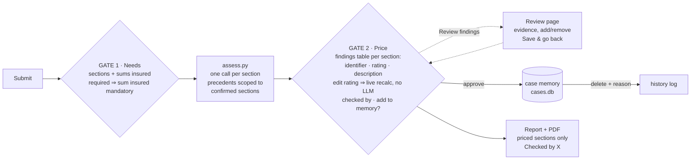

# Change plan — from the 2026-09-01 meeting

**Status: implemented 2026-09-12 (all three phases).** Kept as the record of what changed
and why; the as-built map is [ARCHITECTURE.md](ARCHITECTURE.md).

Source: `Meeting started 2026_09_01 21_36 SAST - Notes by Gemini.md` (decisions + transcript
00:00–00:21). Non-code items from the notes (API key in `.env`, demo screen-share, business
strategy) are not in here.

## Target flow

Today: Submit → Needs → Review (stores the case) → Price → Report → Learn (playbook diff).
Target: Submit → Needs → **Price** (the approval gate) → Report. Review becomes a drill-down.
The playbook and gate 4 go away; case memory is the only learning layer.

## Phases

Each phase ships on its own and leaves tests green. Order matters: 1 removes code the
others would otherwise have to carry.

### Phase 1 — Remove the playbook

| Change | Where |
|---|---|
| Delete playbook load/save/history, `rules_for_section`, `propose_reflection`, `LearningProposal`, `PLAYBOOK_STUB` | `memory.py` |
| Delete `/learning/{id}`, `/playbook`, `PENDING_LEARNING`, `LEARNING_NOTES`, `rule_count` | `main.py`, `report.py`, `index.html` (metric + flow step 04), `base.html` nav |
| Delete `playbook.html`; drop the learning section from `report.html` | `templates/` |
| Drop `playbook_rule_ids` from `RiskFinding`; drop `_available_rule_ids` + rule-citation check | `models.py`, `guardrails.py`, `assess.py` prompt |
| **Move corrections + why-notes into the precedent text** so reviewer lessons still reach the next assessment | `assess.py::_render_precedent` — append `Reviewer changes: removed X ("note"), severity_changed Y low→high ("note")` |
| Stepper: Submit · Needs · Price (Review as drill-down); remove "Learn" | all page templates |
| Tests: delete rules/reflection/playbook tests; repoint `test_correction_reaches_the_next_assessment_prompt_for_its_section` at the precedent text; `test_a_fire_lesson_is_structurally_unable_to_reach_a_motor_assessment` at section-scoped precedents | `tests/test_memory.py`, `tests/test_learning_loop.py`, `tests/test_ui.py`, `tests/test_review.py` |
| Docs: SOLUTION_DESIGN §2 memory table (two layers, not three), ARCHITECTURE flow + file table, README | `docs/`, `README.md` |
| `data/playbook.md`, `data/playbook_history/` no longer created; `reset_demo_data` just clears cases | `memory.py` |

Old `cases.db` rows still load (pydantic ignores the stale `playbook_rule_ids` key).

### Phase 2 — Price is the approval gate

**Needs gate**
- A required section with no sum insured is rejected at `POST /needs/{id}` (same pattern as
  the "no sections required" error) — Cameron: fix it *before* the pricing page. Every line on
  the pricing page is therefore priced; the "not stated" row branch in `pricing.html` goes.

**Draft-based pricing page** — `GET /drafts/{draft_id}/price`
- `confirm_needs` redirects here instead of rendering the review page. Prices with
  `price_case(needs, result.findings, sums)`; nothing stored yet.
- Per section: the existing premium row, plus (expanded by default) a findings table
  **identifier · rating · short description** (`label`, `severity` `<select>`, `assessment_note`
  or first sentence of `reasoning`). Changing a rating re-bands the section client-side
  (mirror `band_for_section` — same rule as `review.html` already mirrors) and re-picks the
  loading from the band table (pass `loadings` to the template) — live totals, no LLM call.
- Loading override input stays; an overridden loading survives a band change only if the user
  typed it (track `data-manual`).
- Commit bar: **Checked by** (text, required), **Add to case memory** (checkbox, default on),
  **Approve & price →**. Link "Review findings & evidence" → `/review/{draft_id}`.
- `POST /drafts/{draft_id}/price`: apply severity edits as `Correction(severity_changed)`
  (reuse `_apply_review` with the `severity_i` fields), recompute pricing server-side, build the
  `CaseRecord`, `memory.store`, redirect to `/cases/{id}` (the report). Unticked "add to memory"
  ⇒ `provisional=True`, which the existing `/cases` "Confirm as precedent" button already
  handles — no new state.
- `/cases/{id}/pricing` (post-approval "Adjust pricing") keeps working: same template, backed
  by the stored case; saving re-stores.

**Review page** as drill-down
- `POST /review/{draft_id}` applies keep/severity/add via `_apply_review`, writes back into
  `DRAFTS[draft_id]["result"].findings`, redirects to the pricing page. Button text: **Save &
  go back**. `/approve` is removed.

**Models**: `CaseRecord.checked_by: str = ""`; `Correction` unchanged.

**Report + PDF**
- Hide unpriced lines (only legacy/chat-ingested cases have them); show **Checked by** in the
  document header and PDF footer instead of "Human approved ✓".
- `test_pdf`, `test_ui`, `test_flow` updated for the new route order.

### Phase 3 — Case memory

**Retrieval scoped to confirmed sections** (`memory.py::retrieve`)
- Signature `retrieve(profile, sections: list[SectionId], k=5)`; candidates are active cases
  with at least one approved finding in any of the confirmed sections; the picker prompt lists
  only those, and says which sections are being assessed. Already called after gate 1, so the
  "only after confirmation" half is free.
- `_assess_one_section` already filters precedent findings per section — unchanged.
- Test: a Motor-only case is never a candidate for a Fire-only assessment.

**Delete with reason + history**
- `CaseRecord` gains `deleted_at`, `deleted_by`, `deleted_reason` (all optional). Soft delete:
  `all_cases()` / `active_cases()` exclude deleted; `get_case` still returns them.
- `POST /cases/{id}/delete` with `reason` + `deleted_by` (required). Button on the case row and
  the case page, `confirm()` prompt.
- `/cases` gets a **Deleted** section (collapsed) listing case, client, who, when, why; the
  existing client-side search covers it. Restore is deliberately absent (open per client).
- `next_case_id` counts all rows including deleted — IDs never reuse.

### Later — decide separately

- **Embeddings for retrieval** ("semantic search / RAG"). The LLM-as-picker is fine at POC
  scale; swap it inside `retrieve()` only. Gemini has an embeddings model; Anthropic/claude-cli
  do not — under the no-fallback rule this would make Gemini the only provider with memory.
  Needs a `llm.embed()` and a vector column in `cases.db`. Not before a client asks.
- Restore for deleted cases.

## Out of scope (noted, not planned)

Gemini key into `.env`; demo via screen-share; base rate 0.2% still to be verified by Sashin;
external work routed through Converge AI; possible extra developer.
