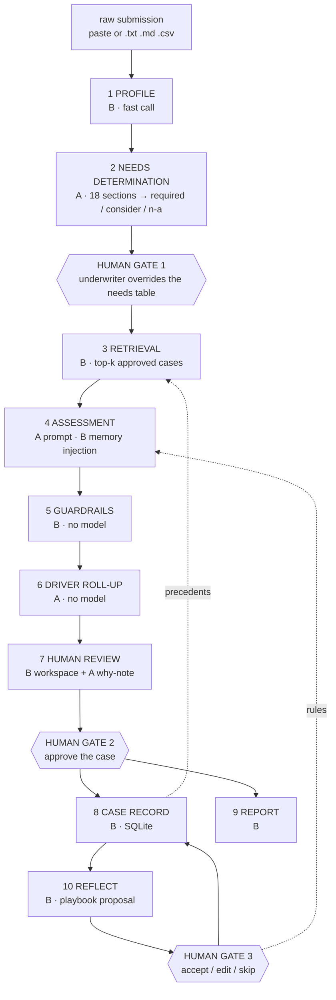

# Consolidation Plan - merging the two builds of Converge Underwriting

**Status:** Proposed, 2026-08-07. Not started. No application code has been changed.
**Decision needed:** the captain's review of this document, plus the three open decisions in §6.
**Scope:** how the two parallel builds of this product become one. It does not change the
design already implemented here - see [SOLUTION_DESIGN.md](SOLUTION_DESIGN.md) for that, and
[ARCHITECTURE.md](ARCHITECTURE.md) for the as-built map.
**Evidence base:** a code-level comparison of both builds, at
`firstmate/data/cu-compare-s5/report.md`. This plan is self-contained; the comparison is the
audit trail behind it, not a prerequisite for reading it.

## How to read this document

Three kinds of statement are kept apart on purpose, because they carry different weight:

| Marker | Meaning |
|---|---|
| **Fact** | Verified by reading, running, or probing the code. Cited `file:line`. |
| **Recommendation** | A judgement call this plan makes. Reversible; argued, not asserted. |
| **OPEN** | Unresolved and awaiting the captain. Nothing downstream of one is settled. |

Three decisions are **OPEN** (§6). Every phase, component and flow step that depends on one is
marked **conditional on OPEN-A/B/C** where it appears. Read those as "this is the shape *if* the
decision goes the recommended way", not as plan.

Model cost appears exactly once, in §9, and it is a development-phase note. It is deliberately
not a constraint on the product specification: this software is intended for licensing to
insurers and brokerages, and their unit economics are theirs to set.

---

## 1. The decision, and the asymmetry that settles it

**This repository (Build B) is the base. The other build (Build A) contributes four things and
is otherwise absorbed.**

The two builds are the same product built twice. Both implement the same four-beat loop - the
LLM proposes, a human corrects, the correction persists, the next assessment is better - and
both put the human in the same place, after a complete draft and before anything is committed.
They diverged on which half of the product to build first.

**Fact.** Build B built the load-bearing half: deterministic verification
(`app/guardrails.py`), governed learning with three separate gates (§2.2 of the comparison;
`app/main.py:134`, `app/memory.py:182-205`, `app/memory.py:132-141`), a persisted case record
(`app/models.py:71-81`), an auditable report (`app/templates/report.html`), and an eval harness
(`app/evaluate.py`). 25 tests pass offline in 0.37s.

**Fact.** Build A built the half that is mostly prompt: an 18-section needs determination
transcribed from the broker needs analysis with scope notes and Motor sub-types
(`server/domain.ts:22-148`, `:155-171`), a cross-section driver roll-up
(`src/DriversPanel.tsx:22-55`), a provider route that runs with no service credential
(`server/provider-cli.ts`), and a reviewer note capturing *why* an edit was made, remembered
verbatim (`src/SectionCard.tsx:301-317`). It persists nothing except corrections. It has no
score, no report, no governance of learning, and no verification of the evidence its own prompt
demands in its strongest prose (`server/prompt.ts:219`, never checked).

**The asymmetry.** This is what makes the direction non-negotiable rather than a preference:

| Direction | What moves | What it costs |
|---|---|---|
| A into B (**proposed**) | ~600 lines: a data table, two prompts, a 35-line grouping function, a slug validator, one transport module | Nothing is discarded that is load-bearing |
| B into A (rejected) | ~1,500 lines of governance, storage, verification and rendering (`app/*.py` 1,110 + templates 424) | Rewrites essentially all of it, and throws away 25 passing tests |

Build A's four contributions are additive and portable. None of them requires Build A's
architecture - a table of 18 records, two prompt builders, a pure grouping function over
findings, and a subprocess call. The reverse port has no such property.

**Fact, and it is the one caveat worth naming here:** Build A assesses each required cover
section in its own model call; Build B assesses the whole document in one. That is not a
detail - the two prompt architectures are built around opposite instructions
(`server/prompt.ts:213` "a fact matters here only insofar as it bears on this section" versus
`app/assess.py:28-29` "read the raw application and identify the risk factors YOU judge
relevant"). It is **OPEN-B** in §6 and it is the largest single thing this plan cannot settle.

---

## 2. Target architecture

Ten steps, three human gates, three model tiers. Every deterministic step is reproducible by
hand, which is the property the whole audit story rests on.



Read it as: **needs are determined and confirmed before anything is assessed; the model
proposes; deterministic code verifies; a human decides three times; memory only ever holds what
a human signed off.**

### The steps in detail

| # | Step | Provenance | Model | Notes |
|---|---|---|---|---|
| 1 | **Profile** - name, industry, size, covers requested, one-line risk character | **B** `app/assess.py:51` | 1 fast call | Unchanged. It already runs before retrieval because it drives it. |
| 2 | **Needs determination** - all 18 sections classified `required` / `consider` / `not-applicable` with a one-line reason; Motor sub-type when Motor is in play | **A** `server/prompt.ts:69-105`, sections from `server/domain.ts:22-148` | 1 main call | New surface. The prompt pushes back on the failure mode that makes needs analysis worthless: *"an analysis that marks everything required is the same as no analysis"* (`server/prompt.ts:80`). |
| - | **HUMAN GATE 1** - the underwriter overrides the table. What it says `required` is what gets assessed. | **A** `src/NeedsPanel.tsx`, rewritten as a Jinja page | - | New gate. Cheap: the happy path is "confirm". |
| 3 | **Retrieval** - top-k approved cases | **B** `app/memory.py:87-115` | 1 fast call | Fails soft by design - any exception returns `[]` (`app/memory.py:112`), because an assessment without precedents beats no assessment. **New:** filter to the confirmed section set, not industry alone. *Conditional on OPEN-B and OPEN-C.* |
| 4 | **Assessment** - section scope + need reason + Motor sub-type, plus playbook rules and precedent findings scoped to the section, plus driver slugs already used on this submission | **A** `server/prompt.ts:182-232`; slug feedback `src/App.tsx:59-67`; memory injection **B** `app/assess.py:52-53` | 1 main call **per required section**, on demand | *Conditional on OPEN-B.* If OPEN-B resolves to single-pass, this stays one call and steps 5-6 lose their per-section subtotals but keep everything else, since findings still carry a section. |
| 5 | **Guardrails** - verbatim evidence check, point caps, citation allow-list, band, referral triggers | **B** `app/guardrails.py` | none | Plain Python, no model. **New:** a minimum quote length (§7.2). **New:** per-section subtotal alongside the case total - *conditional on OPEN-A and OPEN-B.* |
| 6 | **Driver roll-up** - drivers touching two or more sections, grouped, most-cross-cutting first, with the section, finding and severity behind each hit | **A** `src/DriversPanel.tsx:22-55`, ported to Python | none | Deterministic, no model call. **New:** a driver hitting three or more sections at medium-or-above is itself a referral trigger. That trigger reads severity, not points, so it survives OPEN-A either way. |
| 7 | **Human review** - split screen, source document pinned left, click a finding to scroll-and-highlight its evidence, live score recompute, clickable precedent and rule citations, reviewer-added findings must quote the source | **B** `app/templates/review.html`; enforcement `app/main.py:183-187` | - | **New:** grouped by section, needs table shown as context, driver panel. **New:** a free-text "why" note per edit, remembered verbatim (**A** `src/SectionCard.tsx:301-317`). |
| - | **HUMAN GATE 2** - approve the case | **B** `app/main.py:103-134` | - | Unchanged. Only approved cases are stored; unreviewed drafts live in an in-process dict and are discarded. |
| 8 | **Case record** | **B** `app/main.py:134`, `app/models.py:71-81` | - | **New:** the needs table and the driver roll-up are stored with the case, so the report and any later audit can reconstruct why those sections were assessed. |
| 9 | **Report** | **B** `app/templates/report.html` | - | **New:** section-by-section structure, driver appendix, needs rationale. |
| 10 | **Reflect** - the correction diff becomes an editable playbook proposal | **B** `app/memory.py:182-205` | 1 main call | The proposal does not touch the file. `tests/test_memory.py:74-84` asserts exactly that. **New:** rules carry a section tag - *conditional on OPEN-B.* |
| - | **HUMAN GATE 3** - accept / edit-then-accept / skip; previous version archived | **B** `app/main.py:202-222`, `app/memory.py:132-141` | - | Unchanged. Skip is one button and the approved case still becomes a precedent. |

### The three gates, and why there are three

**Fact.** Build A has two decision points and its human is the only safety mechanism in the
system - `POST /api/review` writes straight to disk (`server/index.ts:123-141`). Build B has
three, and its human is the last of three: guardrails delete unverifiable findings before the
human sees them, the human approves the case, and the human separately accepts or rejects any
derived rule. **The consolidated build keeps all three and adds Build A's needs override as
gate 1**, which is the earliest and cheapest place to correct the system: getting the section
set wrong wastes every assessment downstream of it.

**Recommendation.** Keep gate 1 confirm-by-default. Reviewer fatigue is a named risk
(`SOLUTION_DESIGN.md:391-392`) and a third gate only survives contact with real underwriters if
the happy path is one click.

---

## 3. Component provenance

**Fact** for every "From" column entry below; the "Change needed" column is this plan's
proposal.

| Component | From | Change needed |
|---|---|---|
| Provider layer, structured output | **B** `app/llm.py` | Add a `_claude_cli_generate()` porting `server/provider-cli.ts`; add cost/token capture on both routes |
| Data model | **B** `app/models.py` | Add `drivers: list[str]` and a narrative `assessment_note: str` to `RiskFinding`; make `section` an enum over the 18 |
| 18 cover sections + scope notes + Motor sub-types | **A** `server/domain.ts:22-148`, `:155-171` | Transcribe to a Python constant, verbatim - and verified against the PDF, not against either codebase (§5 phase 1) |
| Needs determination prompt | **A** `server/prompt.ts:69-105` | Port; add a `NeedsDetermination` Pydantic model so the response is validated, not hand-parsed |
| Needs review UI | **A** `src/NeedsPanel.tsx` | Rewrite as a Jinja template plus a POST route. No SPA. |
| Per-section assessment prompt | **A** `server/prompt.ts:182-232`, `:234-256` | Port; replace Build A's raw-corrections memory block with Build B's playbook + precedents, section-filtered. *Conditional on OPEN-B.* |
| Driver vocabulary + slug discipline | **A** `server/domain.ts:180-205` (24 slugs), `server/prompt.ts:234-256` | Port verbatim. The vocabulary is what makes the roll-up work: one weakness only groups if the model names it identically each time. |
| Driver slug normalisation | **A** `server/parse.ts:242-266` | Port as a Pydantic field validator (~10 lines), so a near-miss slug still groups |
| Driver grouping | **A** `src/DriversPanel.tsx:22-55` | Port to Python (~35 lines), server-side. The `sectionCount >= 2` filter at `:50` is the whole rule. |
| Guardrails | **B** `app/guardrails.py` | Add a minimum quote length (§7.2); add per-section subtotals (*conditional on OPEN-A, OPEN-B*) |
| Case memory, retrieval, playbook, reflection, versioning | **B** `app/memory.py` | Add section tags on rules and a section filter at both injection points (*conditional on OPEN-B*); add a partition key (*conditional on OPEN-C*) |
| Review workspace | **B** `app/templates/review.html` | Add section grouping, the needs table, the driver panel, and the "why" note |
| Report | **B** `app/templates/report.html` | Add section structure, driver appendix, needs rationale |
| Eval harness | **B** `app/evaluate.py` | Keep as is; re-baseline after the changes land |
| Chat ingestion | **B** `app/ingest_chats.py` | **Gate it** (§7.3) - route through the same acceptance UI, or mark ingested cases provisional |
| Response validation | **B** Pydantic | Build A's 266-line `server/parse.ts` is discarded; structured outputs already do this |
| Reviewer "why" note | **A** `src/SectionCard.tsx:301-317` | Capture in `Correction.detail` (`app/models.py:63-68`, the field exists and is unused by the UI) and feed it to reflection |

---

## 4. What gets discarded, and why that is safe

**From Build A - everything not in the table above.**

| Discarded | Lines | Why it is safe |
|---|---|---|
| `server/memory.ts` and `server/data/memory.json` | 158 | The per-section-corrections mechanism is replaced by section-tagged playbook rules plus case records, which do strictly more: they generalise, they retain the case context a raw correction loses, and they are governed. **Only the scoping idea survives, and it survives as a design requirement** (§6, OPEN-B; the comparison's §3 conflict 4). |
| `server/parse.ts` | 266 | Pydantic plus structured outputs do this for free. Build B already relies on it (`app/llm.py:73-89`). The one part with independent value - slug normalisation at `:242-266` - is ported as a field validator. |
| `server/index.ts`, `server/provider.ts`, `server/provider-sdk.ts` | ~400 | Express plumbing with a FastAPI equivalent already in place. **Fact:** `server/index.ts` has no test coverage at all, including its input validation, so nothing verified is lost. |
| The React SPA - `src/App.tsx`, `SectionCard.tsx`, `api.ts`, `styles.css` | ~1,200 | Build B's server-rendered Jinja review page is the better decision surface, and it is the one with tests (`tests/test_review.py`, `tests/test_ui.py`). There is no SPA requirement here. The two behaviours worth keeping - the slug feedback loop (`src/App.tsx:59-67`) and the "why" note - are ported. |
| Free-text `assessedLevel` + `scale` as the **scored** quantity | `server/domain.ts:334-337` | **Fact, with a receipt.** Build A's live `server/data/memory.json` holds six real corrections from one real session, all on Fire, all from one submission - and the levels the model chose sit on at least four mutually incompatible scales, one of which ("Below standard for occupancy scale") is not an ordinal position at all. Those cannot be summed, ranked, compared across submissions, or trended over a book. **The phrase is kept as a display-only narrative field**, because it carries something a four-value enum does not: it names the reference class the judgement was made against. Build A conflated the arithmetic and the prose into one field and lost the arithmetic. Splitting them loses neither. |
| `NO_PRICING` as an absolute (`server/prompt.ts:19`) | - | **Conditional on OPEN-A.** Build A forbids the model from producing any quantity and asserts the boundary in tests (`server/memory.test.ts:140`). Whether the consolidated build carries an ordinal score at all is the captain's call, not this plan's. Nothing is discarded here until OPEN-A resolves. |

**From Build B: nothing structural.** Two things must change rather than be kept:

- the four-value free-text `section` field (`app/models.py:42` - a docstring naming four values,
  with no enum, no validation, and no list anywhere in the code) becomes an enum over the 18;
- the ungated `reflect()` path in `app/ingest_chats.py:77` is closed (§7.3).

**Not touched by any of this.** Build A's `docs/underwriting-framework.md` stays a separate
motor pricing specification and is out of scope. **Fact:** Build A's own `AGENTS.md:38` records
that the prototype and the framework are separate on purpose. The single place consolidation
brushes against it is OPEN-A.

---

## 5. Phased migration

Ordered so **each phase leaves a working system** - tests green, app runnable, nothing
half-ported. The numbering is dependency order, not calendar order: phase 8 depends on nothing
and should be done first. Sizes are order-of-magnitude estimates, not commitments.

| # | Phase | Rough size | Leaves working | Depends on |
|---|---|---|---|---|
| 1 | Transcribe the 18 sections, scope notes and Motor sub-types into `app/sections.py`; make `RiskFinding.section` an enum over it | ~200 lines | Yes - existing single-pass assessment now returns a validated section | - |
| 2 | CLI provider route in `app/llm.py`; cost/token capture on both routes | ~120 lines | Yes, and for the first time it runs with no service credential | - |
| 3 | Needs determination: prompt, Pydantic model, route, review template. **Human gate 1.** | ~350 lines | Yes - the needs table is produced and confirmed, and the existing assessment runs after it | 1 |
| 4 | Assessment loop: refactor `app/assess.py` from one call to one per confirmed section, on demand | ~200 lines changed | Yes | 3, **OPEN-B** |
| 5 | Section-tagged playbook rules; section filter on retrieval and on injection | ~80 lines | Yes | 4, **OPEN-B**, **OPEN-C** |
| 6 | Drivers: model field, slug validator, grouping, referral trigger, panels | ~150 lines | Yes | 1 |
| 7 | Review + report templates: section grouping, needs table, driver panel, "why" note. **Human gate 2 surface.** | ~250 lines | Yes | 3, 6 |
| 8 | The three standalone defects in §7 | ~40 lines | Yes | - (can ship first) |
| 9 | Tests, and re-baseline `app/evaluate.py` | ~400 lines | Yes | 1-8 |

**Total: roughly 1,400-1,800 lines added or changed on top of Build B's 1,534, with phases 3, 4
and 7 dominating.**

**Conditional phases.** Phase 4 is conditional on **OPEN-B**: if it resolves to single-pass,
phase 4 becomes a much smaller change (the needs table still scopes what the single prompt is
told to cover) and phase 5's section tagging loses most of its point. Phase 5 is additionally
conditional on **OPEN-C**: the partition key belongs in the storage schema, and adding it after
memory holds real client cases is a migration rather than a field.

**Ordering notes.**

- **Phase 8 can go first and should.** All three defects are independent of the consolidation
  decision, all three are small, and each closes a real hole in what the README claims today.
- **Phase 2 early is deliberate.** It is what lets the assessment prompt be iterated on a local
  Claude Code login before any service credential is authorised. **Fact:** this repository
  cannot start without a key - `app/main.py:33` calls `llm.require()` at import and
  `app/llm.py:45-48` is explicit that this is intentional. That is the right production
  posture, and it is also why prompt work currently cannot begin at all.
- **Phase 1 verifies against the PDF, not against Build A.** See §8.
- **Phase 6 is independent of the assessment refactor.** Findings carry a section either way, so
  the roll-up works whether or not OPEN-B resolves to per-section. It is the cheapest real
  capability in this plan.

**The two real risks are not in the line count.** First, tuning the assessment prompt against
real model output - that needs iteration, and it is the actual work. Second, the review page
staying usable when a submission has twelve sections instead of one flat findings list. Neither
is fixed by writing more code carefully; both need a real submission in front of a real
underwriter.

**Order-of-magnitude schedule, stated as an estimate, not a commitment:** phases 1-2 in a day,
3-6 in about a week, 7-9 in a second week, plus prompt iteration bounded by evaluation quality
rather than by code.

---

## 6. Open decisions - **unresolved, awaiting the captain**

These three are not this plan's to make. Each has a standing recommendation, and each
recommendation is what the conditional markings elsewhere in this document assume. **None of
them is settled**, and work downstream of one should not start until it is.

### OPEN-A · Does the consolidated build carry an ordinal risk score? (`scoring-boundary`)

**The tension is real.** Build B's entire deterministic spine is built on `suggested_points:
int` - the caps (`app/guardrails.py:23-28`), the bands at 15/30/50 (`:31`), the boundary
referral within 3 points of a threshold (`:32`), the live recompute the reviewer watches
(`app/templates/review.html:120`), the case comparison, and the eval harness. Build A forbids
the model from producing any quantity at all (`server/prompt.ts:19`: no premium, no rand
amount, no rate, no sum insured, no probability, no arithmetic) and asserts that boundary in
its tests.

You cannot have Build B's guardrails without an ordinal score, and you cannot have Build A's
boundary with one.

**Trade-off.** With a score: reproducible triage, band-based routing, boundary referrals, and a
measurable eval. Without it: no aggregation, no trending across a book, no deterministic
referral logic - and the strongest possible guarantee that nothing the system emits can be read
as a price.

**Standing recommendation.** Keep the score, renamed so it cannot be mistaken for pricing
(`risk_points`, "referral band"; never "rating"), and state in the report UI that pricing is out
of scope. The reasoning: Build B's points are not prices. They are an ordinal triage score whose
only job is to route a case to a band and trigger referrals - no more a premium than a credit
score is a loan amount. Build A's boundary exists because it sits next to a pricing
specification the prototype must not appear to implement.

**But this touches a boundary the captain set deliberately, so it is the captain's call.**
Conditional on it: the per-section subtotals in step 5, the scoring half of phase 5, and the
`NO_PRICING` row in §4.

### OPEN-B · Per-section assessment, or a single pass? (`section-breadth-cost`)

**Reframed on its merits.** Model cost is not the axis this should be decided on - see §9. The
decision key `section-breadth-cost` is kept only because it is the identifier already registered
against this hold; its name predates the reframing and should not be read as its substance.

**What per-section buys.** Depth and coverage: twelve confirmed sections at three to six
findings each is a different artifact from a single pass, which in practice produces a handful
of findings over the whole document. It also buys **scoping** - memory, precedents and referral
logic can each be filtered to the section under assessment, which is the mechanism that makes
Build A's section isolation possible (`server/memory.test.ts:121-184` asserts a Theft correction
is structurally unable to reach a Motor assessment). And it is the only shape under which the
needs determination means anything: **determining that eleven sections are required and then
assessing the document as one blob ignores the sections it just determined.**

**What single-pass buys.** One global view of the business. One model reads everything at once
and can notice interactions across the whole submission that twelve isolated calls structurally
cannot. Build A partly compensates with the driver-slug feedback loop, but only in one
direction: later sections see the slugs earlier sections used (`src/App.tsx:59-67`), never the
reverse. Single-pass also keeps the prompt architecture that is built, tested and working here
today.

**Trade-off, stated plainly.** Per-section is depth and scoping at the cost of the global view.
Single-pass is the global view at the cost of depth, coverage of the determined sections, and
per-section memory and referral scoping.

**Standing recommendation.** Per-section, because the depth *is* the product - a commercial
submission assessed as one blob is roughly what a broker already gets from an underwriter
skimming it - with assessment on demand rather than an automatic fan-out, and with the needs
determination removing the not-applicable sections before anything is assessed. The driver
roll-up (§2 step 6) is the compensating mechanism for the lost global view, and it is worth
building either way.

**Unresolved.** Conditional on it: phases 4 and 5, step 4 of the flow, the per-section
subtotals in step 5, and the section tags in step 10. §8 also records that the "per-section
finds more" claim is **inferred, not measured** - and that it should be measured before phase 4
is committed to.

### OPEN-C · Is case memory shared across insurer clients, or partitioned? (`memory-tenancy`)

**Already flagged in this repository's own design.** `SOLUTION_DESIGN.md:340-344` (§6.6) states
the question and records the POC answer as "single shared memory, flagged in the doc". That was
adequate for a POC. It is not adequate for a product licensed to multiple insurers, which is
what this is now.

**The question.** If insurer A's underwriters correct the system, does insurer B's next
assessment benefit? Concretely: does insurer B's assessment retrieve insurer A's approved cases
as precedents, and does it read playbook rules distilled from insurer A's corrections?

**Trade-off.** Shared memory is a much stronger product - the corpus compounds across every
client, cold start is solved once, and the "it learns" claim gets more convincing with every
insurer onboarded. Partitioned memory is what a data-governance review will almost certainly
require: an insurer's underwriting judgement, and its clients' application data, are its own,
and a competitor benefiting from them is a commercial objection before it is a legal one.

**Standing recommendation.** Partition by default, with pooling as an explicit opt-in per
client. Partitioning a shared store later is a data migration under a governance question that
has already gone wrong; pooling partitioned stores later is a configuration change. Put the
partition key in the schema in phase 5 whichever way this resolves, because the field is cheap
now and a migration later.

**Unresolved, and it blocks more than it looks like it does.** This needs an answer **before
memory holds any real client's cases** - which is before the first pilot, not before general
availability. Conditional on it: phase 5, and the retrieval filter in step 3.

---

## 7. Three standalone defects, independent of the consolidation

**Fact:** all three were reproduced by probing this repository's real code paths. All three are
independent of every decision above, all three are small, and each closes a gap between what the
README claims and what the code does. They can ship immediately, ahead of phase 1.

### 7.1 A compound correction loses the points change

`app/main.py:168` guards the points correction with `and severity == f.severity`, so when a
reviewer changes **both** the severity and the points, only the severity change is recorded.
Probed against the real `_apply_review`:

```
reviewer changes BOTH severity and points → corrections: [('severity_changed', 'high -> medium')]
reviewer changes ONLY points             → corrections: [('points_changed', '15 -> 4')]
```

**Why it matters.** The corrections list is what reflection is fed (`app/memory.py:185`), so on
the most common compound edit the learning step never learns the magnitude of the correction -
only its direction. **One line.**

### 7.2 The evidence check accepts one-word quotes

`app/guardrails.py:65-72` drops any finding whose `evidence_quote` does not appear in the source
document, normalising both sides first (`:53-56`) so punctuation and whitespace differences do
not cause false drops. That is honest deterministic code and `tests/test_guardrails.py:35-45`
covers both directions. **But it verifies that the quote string exists, not that the quote
supports the finding.** Probed against the real `sample_data/sample_application.md`:

```
'Yes'   → passes      'No'  → passes      'Fire' → passes      'cover' → passes
'Asbestos roof throughout' → dropped (correctly)
```

A wholly invented 20-point high-severity finding evidenced by the word "Yes" passes every
guardrail and reaches the reviewer as a clean, cited, evidence-backed finding. The novel-finding
referral that catches this today (`app/guardrails.py:103-109`) disappears the moment the model
can cite any precedent - which is precisely the state the product is designed to reach.

**Fix:** reject quotes below a minimum length and reject stopword-only fragments. **About six
lines**, and it is the difference between the README's claim ("hallucinated evidence is
dropped") and the code's behaviour. The check is a necessary floor and worth keeping; it is not
yet the defence it is described as.

### 7.3 Chat ingestion writes to memory and the playbook with no human gate

`app/ingest_chats.py:44-62` extracts findings from a chat transcript with an LLM, labels them
`approved_findings`, and stores them as a `CaseRecord`. Line 77 then calls `memory.reflect()`,
which is the auto-apply path (`app/memory.py:208-214`) - it writes the playbook with no
acceptance step. **So LLM output enters both memory layers ungated**, which contradicts the
governance rule the whole pitch rests on.

`SOLUTION_DESIGN.md:204-206` already specifies the fix - *"Human spot-check step: the client
reviews a sample of ingested cases before the demo - keeps the 'only approved data enters
memory' rule honest"* - and **that step is not implemented.** It is a seeding job rather than
the hot path, which is why it has survived, but it is an unguarded back door into the one
property the product is sold on.

**Fix:** route ingestion through the same acceptance surface, or mark ingested cases provisional
until a human confirms them.

---

## 8. What remains unverified

Carried forward honestly. The comparison this plan rests on read and probed both codebases; it
did not exercise either against a live model, and two of the gaps below bear directly on
decisions above.

**The 18 sections have never been diffed against the source PDF.** This is the most important
one. **Fact:** the needs-analysis PDF in this repository (`Needs Analysis.pdf`, 112,925 bytes)
and Build A's copy (`docs/NEEDS ANALYSIS - NO SIGNATURE.pdf`) are byte-identical
(`md5 1e9a7c3aafa6ed6bfd905f2e72de6eb6`). **Fact:** this repository contains zero references to
it - `grep -rn -i "pdf"` across `*.py`, `*.md` and `*.html` returns nothing. It sits in the
repository root and nothing reads it. **Fact:** Build A's list of 18 is internally consistent,
ordered, unique and asserted in tests (`server/memory.test.ts:30`, `:210-219`). **Not
verified:** that it is a faithful transcription of the PDF. Nobody has read the PDF and diffed
it. Build A's own `AGENTS.md:13` names the PDF as the **only** authority for the section list
and warns specifically that its Motor section covers own damage as well as third-party
liability. **Phase 1 must do that diff against the PDF, not against Build A's constant.**
Transcribing a transcription is how an error becomes canon.

**"Per-section finds materially more" is inferred, not measured.** It follows from prompt
structure - twelve focused calls each asked for three to six findings, versus one call over the
whole document - and no live model call was made in either build to test it. This is the
evidentiary basis of the standing recommendation on **OPEN-B**, and it is weaker than that
recommendation sounds. `app/evaluate.py` is the right instrument, and the measurement should
happen before phase 4 is committed to. Phase 2 exists so that measurement can be made on a
local login.

**Also unverified:**

- **Retrieval quality**, in either direction. Build B's retrieval is one cheap model call
  ranking one-line case summaries (`app/memory.py:87-115`) and has never been run against a real
  model. Its known scaling limit is structural rather than qualitative: it sends **every** case
  summary in the prompt every time (`app/memory.py:90` calls `all_cases()` with no filter), so
  prompt size grows linearly with the corpus. `SOLUTION_DESIGN.md:254` puts the ceiling at
  "several hundred cases" and §5.4 already specifies the embeddings replacement behind the same
  `retrieve()` interface.
- **Anything about model output quality.** All 25 tests here fake the LLM
  (`tests/conftest.py`), which is the right call for a deterministic offline suite - it proves
  the plumbing and the deterministic layer, not the model's behaviour. Build A's 13 tests are
  the same. Neither build has ever been tested against a real model call.
- **`app/evaluate.py`'s actual behaviour**, which needs a key and stored cases.
- **The Gemini path** (`app/llm.py:73-89`), never executed on the machine the comparison ran on.
- **This repository's provenance.** Its git history is three commits, all dated 2026-08-07, the
  first a squashed initial commit of a complete application, and `SOLUTION_DESIGN.md:3-7` cites a
  "client decision, 2026-07-09" that predates all of them. It appears to be an existing POC from
  an earlier engagement, rebranded. **Inferred, not verifiable from this repository**, and it is
  the most likely explanation for why the section taxonomy is a free-text field: its scope was
  set by different requirements.

---

## 9. Development-phase note on model cost

**Separated deliberately, and it appears nowhere else in this document.** This product is
intended for licensing to insurers and brokerages. Their per-assessment economics are theirs to
set against their own book, their own model contracts and their own volumes, so per-assessment
model cost is **not a design constraint on the target architecture** and is not a reason to
prefer any option in §6.

It bounds one thing that is genuinely ours: **how fast the team can iterate on prompts before
licensing.** Prompt tuning is the real work in phase 4, it is done by running real submissions
repeatedly, and it is paid for out of a development budget.

**Measured figures**, for planning that iteration only: **$1.24 per 12-section submission** and
**$0.20 per single-pass assessment**. The basis is Build A's measured $0.095 per call, documented
and dated at `server/provider.ts:54-56` (measured over five real section assessments, range
$0.088-$0.102). The ratio between the two depends on model tier choice as much as on call count
and should be read as an order of magnitude, not a number.

**Consequences for the development plan, and nothing else:**

- **Phase 2 is scheduled early for this reason.** The keyless CLI route lets prompt iteration
  happen on an existing local Claude Code login, before any service credential or budget is
  authorised. Today this repository cannot start at all without a key (`app/main.py:33`).
- **Cost and token capture belongs on both provider routes** (§3), because iteration you cannot
  measure is iteration you cannot budget. **Fact:** this repository currently reports no cost or
  token usage anywhere - `grep -i "cost\|usage\|token" app/*.py` returns one hit, `max_tokens`.
- **An accidental fan-out across all 18 sections costs real money during development.**
  Assessment on demand, with the section count and an estimate stated before any batch run, is
  the right default for that reason. It is a development-ergonomics decision, not a product
  constraint, and licensees can configure it as they wish.
